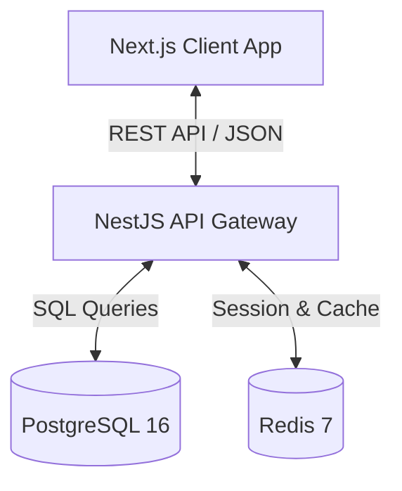

# System Architecture: Personal Finance App (PF)

This document provides a detailed overview of the system architecture for the Personal Finance App. 

## 1. High-Level Architecture

The application is built on a modern, decoupled client-server architecture.

- **Frontend (Client)**: A Next.js application that handles all user interactions, UI rendering, and client-side state.
- **Backend (Server)**: A NestJS REST API that encapsulates all business logic, data validation, and database operations.
- **Data Layer**: PostgreSQL handles persistent data storage. Redis is used for caching and managing stateful elements (like rate-limiting and session verification).

---

## 2. Frontend Architecture

**Path**: `/frontend`
**Core Technologies**: Next.js 15, React 19, Tailwind CSS v4, TanStack React Query v5

### Design Patterns
- **Component-Based UI**: UI is broken down into small, reusable React components.
- **Server/Client Separation**: Uses Next.js App Router. Pages and layouts default to Server Components for performance and SEO, while interactive elements (`"use client"`) handle state and user input.
- **Data Fetching & State**: 
  - **React Query** acts as the async state manager. It handles fetching, caching, synchronizing, and updating server state in the React application.
  - Form state is managed strictly through **React Hook Form**.
- **Validation**: Forms and API responses are heavily typed and validated on the client side using **Zod** schemas.
- **Styling**: Utility-first styling via **Tailwind CSS v4** allowing rapid UI development without external CSS bloat. `clsx` and `tailwind-merge` are utilized for dynamic class composition.

---

## 3. Backend Architecture

**Path**: `/backend`
**Core Technologies**: NestJS 11, Node.js 20+, Drizzle ORM, TypeScript

### Design Patterns
The backend strictly follows Domain-Driven Design (DDD) principles and the standard NestJS modular architecture.

- **Modules**: The app is divided into feature modules (e.g., `AuthModule`, `UsersModule`, `TransactionsModule`, `BudgetsModule`). Each module encapsulates its own controllers, services, and repositories.
- **Controllers**: Handle incoming HTTP requests, route them to the appropriate services, and return responses. They use **Swagger** decorators for automatic API documentation.
- **Services (Providers)**: Contain the core business logic. Controllers should be lean, passing logic to these injectable services.
- **Data Access Layer (Drizzle ORM)**: Instead of a heavy ORM pattern like Active Record, Drizzle acts as a thin, type-safe SQL wrapper. Schema is defined in TypeScript (`src/db/schema/index.ts`).
- **Global Pipes & Filters**: 
  - `ValidationPipe`: Enforces strict payload validation via `class-validator` and `class-transformer`.
  - `GlobalExceptionFilter`: Catches unhandled errors and normalizes the JSON error response across the API.
  - `LoggingInterceptor`: Standardizes request/response logging for observability.

---

## 4. Database Schema & Data Model

**Technologies**: PostgreSQL 16
The database is relational. A primary design constraint is that **all currency amounts are stored in integer cents** (e.g., `amountCents`) to completely avoid floating-point math inaccuracies.

### Core Tables
1. **Users**: Primary entity. Contains email, `passwordHash`, `googleId` for OAuth, `twoFactorSecret`, and timezone settings. Implements soft deletes (`deletedAt`).
2. **Refresh Tokens**: Maps to users for secure JWT rotation. Includes fingerprinting (IP address, user agent).
3. **Categories**: User-specific buckets for transactions. Differentiated by `type` (income/expense), and includes UI metadata like `color` and `icon`.
4. **Transactions**: The main ledger. Links a `User`, a `Category`, a monetary amount, and a specific date. 
5. **Budgets**: User-defined monthly thresholds. Can be global (no category linked) or category-specific (linked to a category ID) for a given year/month combination.

*Relationships are strictly enforced via Foreign Keys with cascading deletes where appropriate.*

---

## 5. Security & Authentication Flow

Authentication is robust and designed for a modern Single Page Application (SPA).

- **Token-Based Auth (JWT)**:
  - **Access Tokens**: Short-lived JWTs. The frontend attaches this to the `Authorization: Bearer` header of every API request.
  - **Refresh Tokens**: Long-lived, opaque tokens stored securely (often as `httpOnly` cookies or encrypted in the DB) to obtain new Access Tokens without prompting the user to log in again.
- **OAuth Integration**: Support for Google Sign-In, allowing users to bypass traditional passwords.
- **Two-Factor Authentication (2FA)**: Uses time-based one-time passwords (TOTP). The secret is encrypted before being stored in the database.
- **Security Middleware**: 
  - **Helmet**: Secures HTTP headers.
  - **CORS**: Strictly limited to the frontend application origin.
  - **Rate Limiting (Throttler)**: Prevents brute-force attacks on endpoints like login and registration.

---

## 6. Infrastructure & Deployment

- **Containerization**: Local development infrastructure (Database, Redis) is managed via Docker Compose (`docker-compose.yml`), ensuring environment parity across developers.
- **Environment Management**: Secrets and configurations are loaded via `.env` files and strictly validated at runtime using NestJS `ConfigService`.

---

## 7. Future Architectural Considerations

- **Redis Integration**: As the app scales, Redis will be transitioned from basic rate-limiting to caching heavy aggregate queries (e.g., dashboard statistics, monthly PDF report generation data).
- **Background Jobs / Queues**: For heavy tasks like generating large PDF reports or sending email notifications, a queueing system (like BullMQ via Redis) should be introduced to prevent blocking the main Node.js event loop.
