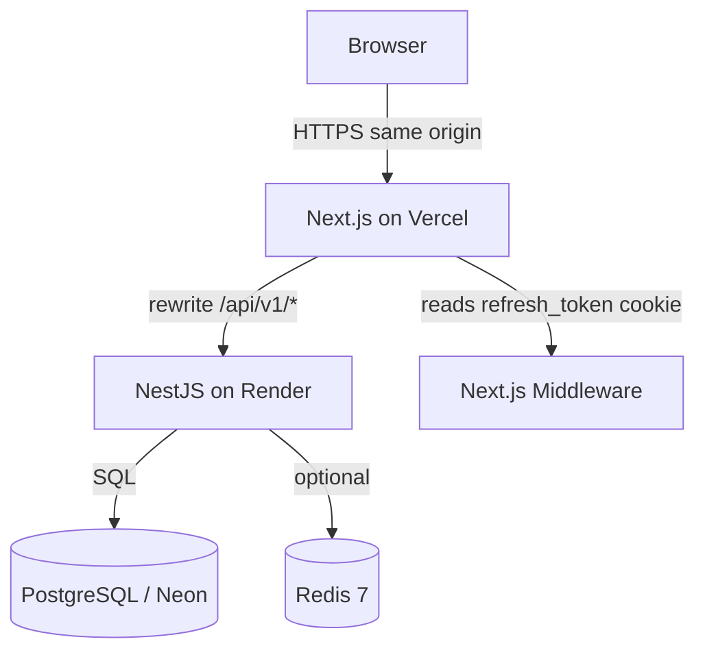
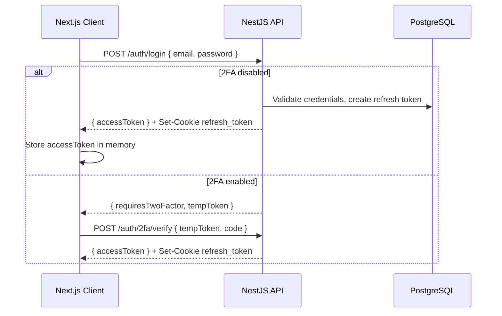

# System Architecture: Personal Finance App (PF)

This document describes the system architecture for the Personal Finance App — how the frontend, backend, data layer, and deployment environments fit together.

---

## 1. High-Level Architecture

The application uses a decoupled client-server model. The Next.js frontend owns the browser origin; the NestJS API owns business logic and persistence.



| Layer | Technology | Role |
| --- | --- | --- |
| **Frontend** | Next.js 15, React 19 | UI, client state, route protection, API proxy rewrites |
| **Backend** | NestJS 11, Node.js 20+ | REST API, validation, auth, business logic |
| **Database** | PostgreSQL 16 | Persistent relational storage (Neon in production) |
| **Cache / limits** | Redis 7 (optional) | Distributed rate-limit storage for `@nestjs/throttler` |

**Local development** mirrors production topology with Docker Compose (Postgres + Redis) and Next.js rewrites pointing at `http://localhost:3001/api/v1`.

**Production** splits across Vercel (frontend), Render (API), and Neon (database). The frontend never exposes the Render URL to the browser — see [Deployment](#6-infrastructure--deployment).

---

## 2. Frontend Architecture

**Path**: `frontend/`  
**Core technologies**: Next.js 15, React 19, Tailwind CSS v4, TanStack React Query v5

### App structure

The App Router organizes pages into route groups:

| Group | Paths | Purpose |
| --- | --- | --- |
| Public marketing | `/` | Landing page |
| Auth | `/login`, `/register` | Credential flows |
| App shell `(app)` | `/dashboard`, `/transactions`, `/budgets`, `/reports`, `/settings` | Authenticated experience with shared sidebar layout |

Interactive pages use `"use client"`; layouts and static content can remain server components.

### Key design patterns

- **Component-based UI** — Feature folders under `src/components/` (dashboard, forms, settings, reports, ui).
- **API module layer** — `src/lib/api/` wraps REST endpoints (`auth`, `transactions`, `categories`, `calculations`, `reports`, `account`, `users`).
- **React Query hooks** — `src/lib/hooks/` encapsulate fetch/mutation logic, cache keys, and invalidation.
- **Forms** — React Hook Form + Zod resolvers for login, transactions, categories, and settings.
- **Styling** — Tailwind CSS v4 with Carbon-inspired tokens; `clsx` + `tailwind-merge` for conditional classes.

### API client and session handling

[`frontend/src/lib/api/client.ts`](frontend/src/lib/api/client.ts) is the single fetch gateway:

1. Sends requests to `NEXT_PUBLIC_API_URL` (default `/api/v1`) with `credentials: "include"`.
2. Attaches the in-memory access token as `Authorization: Bearer …` when present.
3. On `401`, calls `POST /auth/refresh` once to obtain a new access token from the httpOnly cookie, then retries.
4. On refresh failure, clears the session and redirects to `/login`.

Access tokens live in memory (not localStorage). Refresh tokens live in httpOnly cookies so JavaScript cannot read them — middleware only checks for cookie *presence*, not validity.

### Route protection

[`frontend/src/middleware.ts`](frontend/src/middleware.ts) runs on protected and auth routes:

- Protected paths without a `refresh_token` cookie → redirect to `/login?next=…`
- Auth paths with a cookie → redirect to `/dashboard`

This is a lightweight gate. Actual token validation happens on the API when data is fetched.

### API proxy (development and production)

[`frontend/next.config.ts`](frontend/next.config.ts) rewrites browser requests:

```
/api/v1/:path*  →  API_PROXY_TARGET/:path*
```

Defaults to `http://localhost:3001/api/v1` locally. On Vercel, `API_PROXY_TARGET` points at the Render service. Keeping API calls same-origin ensures refresh cookies are first-party and CORS stays simple.

---

## 3. Backend Architecture

**Path**: `backend/`  
**Core technologies**: NestJS 11, Node.js 20+, Drizzle ORM, TypeScript

### Module layout

The API follows NestJS feature modules. Each module owns its controller(s), service(s), and DTOs:

| Module | Responsibility |
| --- | --- |
| `AuthModule` | Register, login, refresh, logout, Google OAuth, 2FA |
| `UsersModule` | Profile updates, password changes |
| `CategoriesModule` | Income/expense category CRUD |
| `TransactionsModule` | Ledger CRUD, filters, projected balance |
| `BudgetsModule` | Monthly budget upsert and status vs actual spending |
| `AccountModule` | Account setup, balance summary, savings sectors |
| `CalculationsModule` | Monthly/quarterly/yearly aggregates, category breakdown |
| `ReportsModule` | CSV stream and PDF generation |
| `DbModule` | Global Drizzle connection (`DB_TOKEN`) |

Cross-cutting code lives in `src/common/`:

- **Guards** — `JwtAuthGuard` (global, `@Public()` opt-out), `ThrottlerGuard`
- **Interceptors** — `LoggingInterceptor`, `TransformInterceptor` (`{ data, meta }` wrapper)
- **Filters** — `GlobalExceptionFilter`, `ThrottlerExceptionFilter`
- **Middleware** — `RequestIdMiddleware` (`X-Request-Id`)

Controllers use Swagger decorators; interactive docs mount at `/api/docs` when enabled.

### Request lifecycle

```
HTTP Request
  → RequestIdMiddleware
  → ThrottlerGuard (rate limit by user ID or IP)
  → JwtAuthGuard (unless @Public())
  → ValidationPipe (whitelist + transform DTOs)
  → Controller → Service → Drizzle (PostgreSQL)
  → TransformInterceptor (JSON success wrapper)
  → Response
```

File download endpoints (`/reports/csv`, `/reports/pdf`) write directly to the Express response and skip the JSON wrapper.

### Data access

Drizzle schema is defined in TypeScript at `src/db/schema/index.ts`. Services use typed queries via the injected `DrizzleDB` handle. Migrations are generated and applied through Drizzle Kit (`npm run db:generate`, `npm run db:migrate`).

---

## 4. Database Schema & Data Model

**Technology**: PostgreSQL 16

All currency values persist as **integer cents** (`amountCents`, `initialBalanceCents`, etc.) to avoid floating-point errors. Services convert to decimal dollars at the API boundary where appropriate.

### Core tables

| Table | Description |
| --- | --- |
| **users** | Primary entity — email, password hash, Google ID, avatar, encrypted 2FA secret, timezone, soft delete |
| **refresh_tokens** | Opaque refresh tokens (hashed), grouped by `tokenFamily` for rotation, with user-agent/IP metadata |
| **categories** | User-scoped income/expense labels with color, icon, sort order, default flag |
| **transactions** | Ledger entries — amount, type, date, note, denormalized month/year for efficient period queries |
| **budgets** | Monthly caps — global (`categoryId` null) or per-category, unique per user/year/month/category |
| **account_config** | One row per user — initial balance and low-balance alert threshold |
| **savings_sectors** | Named allocation buckets with percentage, styling, optional target amount |

Foreign keys enforce ownership. Deleting a user cascades to dependent rows.

---

## 5. Security & Authentication Flow

Authentication is designed for a SPA-style frontend with short-lived access tokens and rotating refresh cookies.

### Token model

| Token | Lifetime | Storage | Transport |
| --- | --- | --- | --- |
| **Access token** | ~15 minutes (`JWT_EXPIRES_IN`) | In-memory on frontend | `Authorization: Bearer` header |
| **Refresh token** | ~7 days (`REFRESH_TOKEN_EXPIRES_IN`) | httpOnly cookie + hashed in DB | Cookie on `/auth/refresh`, `/auth/login`, OAuth callback |

Refresh tokens use **token-family rotation**: each refresh invalidates the previous token in the family and issues a new pair. Reuse of a revoked token can invalidate the entire family.

### Login flow



### Session refresh

When an API call returns `401`, the client POSTs to `/auth/refresh` with credentials. The backend validates the cookie, rotates the refresh token, and returns a new access token. Middleware only checks cookie presence; expired or revoked cookies fail at refresh time and send the user to login.

### Additional security controls

- **Google OAuth** — Passport Google strategy; callback upserts the user, sets cookies, redirects to frontend with access token in query string (frontend callback handler pending).
- **2FA (TOTP)** — Secret encrypted with `TWO_FACTOR_ENCRYPTION_KEY`; setup/enable/disable via authenticated endpoints.
- **Helmet** — Security headers including CSP tuned for Swagger in development.
- **CORS** — Locked to `FRONTEND_URL` with `credentials: true`.
- **Rate limiting** — Global default (100 req/min) plus stricter per-route limits on auth and report endpoints. Redis storage used when `REDIS_URL` is set; otherwise in-memory fallback.
- **Password hashing** — bcrypt for credential accounts.

---

## 6. Infrastructure & Deployment

### Local development

[`docker-compose.yml`](docker-compose.yml) provides:

- **postgres** — `financeapp_dev` on port 5432
- **redis** — port 6379 (optional but recommended for rate-limit parity)

Environment files:

- `backend/.env` — `DATABASE_URL`, JWT secrets, `FRONTEND_URL`, optional OAuth and Redis
- `frontend/.env` — `NEXT_PUBLIC_API_URL=/api/v1`, optional `API_PROXY_TARGET`

### Production topology

| Service | Platform | Notes |
| --- | --- | --- |
| Frontend | Vercel | Deploy from `frontend/`; set rewrite env vars |
| Backend | Render | Web service; `DATABASE_URL` from Neon |
| Database | Neon | Serverless PostgreSQL |

**Vercel environment variables**

- `NEXT_PUBLIC_API_URL=/api/v1`
- `API_PROXY_TARGET=https://<render-service>.onrender.com/api/v1`

**Render environment variables**

- `DATABASE_URL`, `JWT_SECRET`, `REFRESH_TOKEN_SECRET`, `TWO_FACTOR_ENCRYPTION_KEY`
- `FRONTEND_URL` (Vercel domain), `BACKEND_URL` (Render URL)
- Optional: `REDIS_URL`, `GOOGLE_CLIENT_ID`, `GOOGLE_CLIENT_SECRET`, `ENABLE_SWAGGER=true`

Do not point `NEXT_PUBLIC_API_URL` at Render directly — cross-origin cookies would break middleware session detection and complicate CORS.

---

## 7. Frontend ↔ Backend Integration Map

| Frontend surface | Primary API modules |
| --- | --- |
| Login / Register | `auth` |
| Dashboard | `calculations`, `account` |
| Transactions | `transactions`, `categories` |
| Reports | `reports`, `calculations` (preview) |
| Settings → Profile / Security | `users`, `auth` (2FA, me) |
| Settings → Categories | `categories` |
| Settings → Account | `account` |
| Budgets (placeholder) | `budgets` (ready, not wired in UI) |

React Query cache keys are colocated with hooks (for example `useTransactions`, `useMonthlySummary`, `useAccount`) and invalidated after mutations that affect derived summaries.

---

## 8. Future Architectural Considerations

- **Budgets UI** — Wire existing `budgets` endpoints into the `/budgets` page with React Query hooks mirroring transactions/categories patterns.
- **Auth callback routes** — Add `/2fa` (login verification) and `/auth/oauth/callback` (Google token handoff) on the frontend.
- **Query caching** — Extend Redis beyond rate limiting to cache heavy aggregate queries (dashboard summaries) with explicit invalidation on transaction writes.
- **Background jobs** — Queue large PDF batches or email notifications via BullMQ (Redis-backed) to avoid blocking the Node.js event loop.
- **Observability** — Structured logging correlation via `X-Request-Id`, health checks, and metrics for Render/Vercel deployments.
