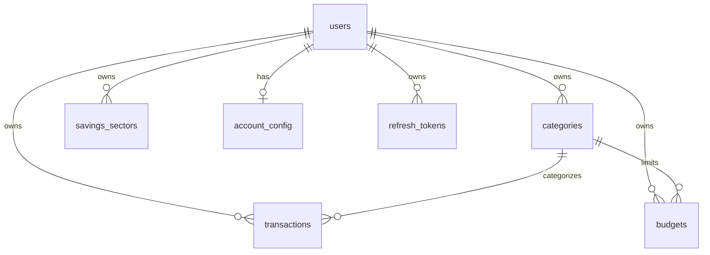

# Personal Finance App — Project Wiki

A modern, full-stack personal finance web application for tracking income and expenses, organizing spending by category, allocating funds across savings sectors, setting monthly budgets, and exporting financial reports. Built with a multi-tenant architecture where every user's financial data is strictly isolated and secure.

The application features a NestJS 11 REST API, a Next.js 15 (React 19) App Router frontend, a PostgreSQL 16 database managed with Drizzle ORM, and optional Redis 7 caching and rate limiting.

---

## Table of Contents

- [What Problem Does It Solve?](#what-problem-does-it-solve)
- [Architecture](#architecture)
- [Tech Stack](#tech-stack)
- [Data Model](#data-model)
- [Feature Status & Roadmap](#feature-status--roadmap)
- [Repository Layout](#repository-layout)
- [Quick Start](#quick-start)
  - [Option A: Full Stack with Docker (Recommended)](#option-a-full-stack-with-docker-recommended)
  - [Option B: Local Development (Hybrid Docker)](#option-b-local-development-hybrid-docker)
- [Frontend Routes](#frontend-routes)
- [API Snapshot](#api-snapshot)
- [Conventions & Security](#conventions--security)
- [License](#license)

---

## What Problem Does It Solve?

Managing personal finances often involves cumbersome spreadsheets or overly complex tools that do not match daily spending workflows. This app provides a clean, focused, and intuitive financial dashboard:

- **Track Transactions** — Record income and expense entries with dates, amounts, categories, and descriptive notes. Includes balance projection previews and soft-delete capabilities.
- **Account & Savings Sectors** — Track all-time net balance, configure starting balances and low-balance warnings, and allocate funds into custom savings sectors (e.g., Emergency Fund, Investments, Vacation) with target goals and progress metrics.
- **Organize with Categories** — Categorize transactions with customizable colors and icons. Seeded with default categories upon registration.
- **Set Monthly Budgets** — Define monthly limits per category or across the entire account, and track budget vs. actual spending in real time.
- **Visual Analytics** — Interactive dashboards with monthly, quarterly, and yearly summaries plus visual category breakdowns powered by Recharts.
- **Export Financial Reports** — Generate and download CSV and PDF reports for custom billing periods with preview and history tracking.
- **Theme Customization** — Native dark and light mode support with automatic system preference detection and local storage persistence.
- **Enterprise-Grade Security** — Email/password credentials, Google OAuth 2.0 integration, short-lived JWT access tokens with rotating httpOnly refresh cookies, and optional TOTP-based two-factor authentication (2FA).

> [!NOTE]
> **Currency Handling**: Monetary values are stored as **integer cents** in PostgreSQL (`amountCents`) to eliminate floating-point rounding errors. User-facing inputs and standard API request/response payloads utilize **decimal dollars** (e.g. `49.99`).

---

## Architecture

The system uses a decoupled client-server model. The Next.js frontend owns the browser origin and proxies API requests to the backend, keeping authentication cookies first-party.

```
┌────────────────────────────────┐       /api/v1 (same origin)       ┌───────────────────────────────┐
│     Next.js 15 Client          │ ◄───────────────────────────────► │       NestJS 11 API           │
│  (Port 3000 / Vercel / Docker) │     rewrite → API backend         │ (Port 3001 / Render / Docker) │
└───────────────┬────────────────┘                                   └───────┬──────────────┬────────┘
                │ middleware reads refresh_token cookie                      │              │
                │ (first-party httpOnly cookie via proxy)                    │ SQL          │ Throttler
                │                                                            ▼              ▼
                │                                                     ┌────────────┐ ┌────────────┐
                │                                                     │ PostgreSQL │ │   Redis    │
                │                                                     │     16     │ │ 7 (opt.) │
                └─────────────────────────────────────────────────────└────────────┘ └────────────┘
```

| Component | Location | Role |
| --- | --- | --- |
| **Frontend** | [`frontend/`](frontend/) | Next.js 15 App Router UI — dashboard, account, transactions, reports, settings |
| **Backend API** | [`backend/`](backend/) | NestJS REST API under `/api/v1` — authentication, CRUD, aggregation, reports |
| **Database** | [`backend/src/db/`](backend/src/db/) | PostgreSQL 16 relational database with Drizzle ORM schemas and migrations |
| **Infrastructure** | [`docker-compose.yml`](docker-compose.yml) | Docker Compose orchestrating PostgreSQL 16, Redis 7, NestJS API, and Next.js |
| **Production** | Vercel + Render + Neon | Frontend deployed on Vercel, API hosted on Render, PostgreSQL hosted on Neon |

### API Proxy & Cookie Strategy

In development and production, the browser communicates strictly with the frontend origin (`/api/v1/*`). Next.js rewrites these requests to the backend API (`API_PROXY_TARGET`):
- Keeps the `refresh_token` httpOnly cookie first-party, avoiding cross-site third-party cookie restrictions.
- Allows Next.js Edge middleware to detect session presence and gate protected routes before rendering.
- Eliminates CORS issues in production environments.

---

## Tech Stack

| Layer | Technology | Description |
| --- | --- | --- |
| **Frontend Framework** | Next.js 15 (React 19) | App Router, Server and Client Components, Edge Middleware |
| **Styling & Design** | Tailwind CSS v4 | Carbon-inspired UI design tokens, responsive typography, Dark Mode support |
| **Client State & Cache** | TanStack React Query v5 | Server state caching, optimistic updates, background refetching |
| **Forms & Validation** | React Hook Form + Zod | Type-safe form validation and error handling |
| **Visualizations** | Recharts & Lucide React | Donut charts, bar charts, trend lines, and UI iconography |
| **Backend Framework** | NestJS 11 (Node.js 20+) | Modular TypeScript architecture with dependency injection |
| **Database & ORM** | PostgreSQL 16 + Drizzle ORM | Type-safe queries, relational joins, and automated schema migrations |
| **API Validation & Docs** | class-validator & Swagger | DTO validation, transformation, and OpenAPI 3.0 documentation at `/api/docs` |
| **Authentication & Crypto** | Passport, JWT, bcrypt, speakeasy | Access/refresh token lifecycle, encrypted TOTP secrets, OAuth 2.0 |
| **Reports Engine** | fast-csv & @react-pdf/renderer | Streaming CSV generation and server-side PDF document rendering |
| **Rate Limiting** | @nestjs/throttler | IP/user rate limiting backed by in-memory or Redis storage |
| **Containerization** | Docker & Docker Compose | Multi-stage production container builds and automated migration entrypoints |

---

## Data Model

All models are defined in [`backend/src/db/schema/index.ts`](backend/src/db/schema/index.ts) with strict multi-tenant isolation:



| Table | Purpose |
| --- | --- |
| **`users`** | Account identity: email, password hash, optional Google ID, avatar URL, encrypted 2FA secret, 2FA enabled status, timezone, soft delete timestamp. |
| **`categories`** | Income and expense categories scoped per user: name, type (`income`/`expense`), color hex, icon identifier, display sort order, and default status flag. |
| **`transactions`** | Financial ledger entries: amount in integer cents, type (`income`/`expense`), date, note, denormalized month/year for fast querying, and category reference. |
| **`budgets`** | Monthly spending limits: year, month (1–12), amount in cents, and optional category reference (null indicates global monthly cap). |
| **`account_config`** | User account settings: initial starting balance (cents) and low-balance warning threshold (cents). |
| **`savings_sectors`** | Balance allocation buckets: sector name, allocation percentage (sum <= 100%), color, icon, and optional target goal amount in cents. |
| **`refresh_tokens`** | Secure session storage: hashed token value, family rotation UUID, expiration date, user agent, and IP address fingerprint. |

---

## Feature Status & Roadmap

### Implemented

#### Authentication & Security
- User registration and password login with validation.
- Short-lived JWT access tokens (15m in memory) and long-lived httpOnly `refresh_token` cookies (7d) with automatic token rotation and family invalidation.
- Google OAuth 2.0 authentication (`GET /auth/google`, `GET /auth/google/callback`).
- Time-based One-Time Password (TOTP) 2FA: setup (`POST /auth/2fa/setup` with QR code), verification and activation (`POST /auth/2fa/enable`), and disabling.
- Profile management (display name, avatar, timezone) and secure password change.
- Centralized frontend client with automatic 401 token refresh queue and session recovery.

#### Financial Modules
- **Account Overview (`/account`)**: Current net balance display, low-balance detection, savings sector table with allocation percentage, current dollar amount, goal amount, progress indicator, and interactive Recharts pie chart.
- **Transactions (`/transactions`)**: Searchable, paginated transaction ledger with filters (type, category, date range, search query). Create/edit modals with projected balance preview. Delete transaction with confirmation modal and soft-delete persistence.
- **Categories (`/settings?tab=categories`)**: Seeded default categories on signup, custom category creation, category editing, color/icon styling, and deletion protection for system defaults.
- **Budgets (Backend)**: Upsert monthly caps per category or overall (`PUT /budgets`), calculate actual vs. budgeted spending with remaining amounts and exceeded flags (`GET /budgets/status`).
- **Analytics & Calculations**: Backend calculation engine for monthly summaries (`GET /calculations/monthly`), quarterly rollups (`GET /calculations/quarterly`), yearly metrics (`GET /calculations/yearly`), and category breakdowns (`GET /calculations/category-breakdown`).
- **Reports (`/reports`)**: Customizable date range filter, preview data table, streaming CSV export, and PDF document generation.

#### Frontend & UI
- Responsive layout with desktop sidebar, mobile drawer, and quick navigation.
- Dark mode and light mode switcher with system theme fallback and localStorage persistence.
- Design tokens inspired by IBM Carbon with compact typography, clean borders, and calm loading skeletons.
- Tabbed settings page (Profile, Security & 2FA, Preferences, Categories, Account configuration).
- Standalone error boundary (`error.tsx`) and not found page (`not-found.tsx`).

#### Infrastructure & Operations
- Complete Dockerization with multi-stage Dockerfiles for backend and frontend.
- Automated database migrations run on container startup via `backend/docker-entrypoint.sh`.
- Comprehensive Swagger/OpenAPI interactive documentation at `/api/docs`.
- Standardized API response envelopes (`{ data, meta }`) and global error formatting (`{ statusCode, message, requestId, timestamp }`).

---

### In Progress & Known Considerations

- **Budgets UI**: The `/budgets` route currently displays a page header placeholder; full UI for setting monthly category limits and visualizing budget burn rates is in development.
- **Dedicated 2FA Login Route**: The login form redirects to `/2fa` when `requiresTwoFactor: true` is returned; completing the dedicated two-step verification screen is planned.
- **Google OAuth Frontend Landing**: Backend redirects to `/auth/oauth/callback?token=...`; frontend callback route handler is planned.
- **Middleware Protected Routes Matcher**: Next.js `middleware.ts` protected list currently contains `/dashboard`, `/transactions`, `/budgets`, `/reports`, `/settings`; updating matcher to explicitly include `/account` will align route gating.

---

## Repository Layout

```text
PF/
├── backend/                        # NestJS REST API
│   ├── Dockerfile                  # Production multi-stage Docker build
│   ├── docker-entrypoint.sh        # Container startup migration runner
│   ├── drizzle/                    # Generated SQL migration files
│   ├── drizzle.config.ts           # Drizzle Kit configuration
│   ├── src/
│   │   ├── common/                 # Guards, interceptors, filters, decorators
│   │   ├── config/                 # Joi-validated environment config
│   │   ├── db/                     # Drizzle schema definitions and database connection
│   │   ├── modules/
│   │   │   ├── account/            # Account setup, summary, and savings sectors
│   │   │   ├── auth/               # JWT, cookies, Google OAuth, TOTP 2FA
│   │   │   ├── budgets/            # Monthly budget limits and status calculations
│   │   │   ├── calculations/       # Monthly, quarterly, yearly metrics & breakdowns
│   │   │   ├── categories/         # Category CRUD and default seeders
│   │   │   ├── reports/            # CSV (fast-csv) and PDF (@react-pdf/renderer)
│   │   │   ├── transactions/       # Ledger CRUD, filters, projected balance
│   │   │   └── users/              # User profile and password management
│   │   └── main.ts                 # Bootstrap, Swagger setup, global pipes
│   └── package.json
├── frontend/                       # Next.js 15 App Router client
│   ├── Dockerfile                  # Standalone Next.js Docker build
│   ├── next.config.ts              # API proxy rewrites (/api/v1 -> backend)
│   ├── src/
│   │   ├── app/
│   │   │   ├── (app)/              # Authenticated layout & routes
│   │   │   │   ├── account/        # Account balance & savings sectors page
│   │   │   │   ├── budgets/        # Budgets page
│   │   │   │   ├── dashboard/      # Analytics dashboard
│   │   │   │   ├── reports/        # Financial reports export page
│   │   │   │   ├── settings/       # Settings (profile, security, categories, account)
│   │   │   │   └── transactions/   # Transaction ledger and CRUD modals
│   │   │   ├── (auth)/             # Auth layout (login, register)
│   │   │   ├── globals.css         # Tailwind CSS v4 design tokens & dark mode
│   │   │   ├── layout.tsx          # Root HTML layout and providers
│   │   │   ├── middleware.ts       # Edge route protection & cookie gate
│   │   │   └── page.tsx            # Public marketing landing page
│   │   ├── components/             # Reusable UI, form, layout, and chart components
│   │   └── lib/                    # API clients, React Query hooks, format utilities
│   └── package.json
├── docker-compose.yml              # Local & full-stack container orchestration
├── .env.example                    # Root environment variable template for Docker
├── ARCHITECTURE.md                 # System architecture and design documentation
├── DESIGN.md                       # Carbon-inspired design system specifications
├── E2E_QA_TICKET.md                # End-to-end testing matrix and defect tracking
├── README.md                       # Quick start and project overview
└── WIKI.md                         # Extended project wiki (this document)
```

---

## Quick Start

You can run the application using either **Docker Compose** (full stack containerized) or in **Local Development mode** (running Postgres/Redis in Docker and Node services on the host).

### Option A: Full Stack with Docker (Recommended)

Requires [Docker Desktop](https://www.docker.com/products/docker-desktop/).

1. **Copy the root environment configuration**:
   - On Bash / macOS / Linux:
     ```bash
     cp .env.example .env
     ```
   - On Windows PowerShell:
     ```powershell
     Copy-Item .env.example .env
     ```

2. **Configure secrets in `.env`**:
   Ensure `JWT_SECRET`, `REFRESH_TOKEN_SECRET`, and `TWO_FACTOR_ENCRYPTION_KEY` (64-character hex string) are set.

3. **Start the complete stack**:
   ```bash
   docker compose up --build
   ```

   - **Frontend App**: `http://localhost:3000`
   - **Backend API**: `http://localhost:3001/api/v1`
   - **Interactive API Docs (Swagger)**: `http://localhost:3001/api/docs`

To stop the containers:
```bash
docker compose down
```
*(Add `-v` if you wish to reset the database and Redis volumes).*

---

### Option B: Local Development (Hybrid Docker)

#### 1. Start Database & Redis
From the repository root:
```bash
docker compose up -d postgres redis
```

#### 2. Run the Backend API
```bash
cd backend
cp .env.example .env     # or Copy-Item .env.example .env
npm install
npm run db:migrate       # Apply Drizzle migrations
npm run start:dev        # Starts NestJS watch mode on port 3001
```

#### 3. Run the Frontend Client
In a separate terminal:
```bash
cd frontend
cp .env.example .env     # or Copy-Item .env.example .env
npm install
npm run dev              # Starts Next.js dev server on port 3000
```

Browser traffic directed to `http://localhost:3000/api/v1` will be proxied automatically to `http://localhost:3001/api/v1`.

---

## Frontend Routes

| Route | Access | Purpose |
| --- | --- | --- |
| `/` | Public | Marketing landing page with hero CTA and feature highlights |
| `/login` | Public | User sign-in (email/password and Google OAuth); redirects authenticated users |
| `/register` | Public | New account registration; auto-seeds default categories |
| `/dashboard` | Protected | High-level analytics: monthly/quarterly/yearly summaries & category spend charts |
| `/account` | Protected | Account overview: current balance, savings sectors table, allocation %, and Recharts pie chart |
| `/transactions` | Protected | Transaction ledger: search, filtering, projected balance, create/edit modals, delete confirmation |
| `/budgets` | Protected | Monthly budget management per category and overall (UI in development) |
| `/reports` | Protected | Report generation: billing period picker, preview table, CSV download, and PDF export |
| `/settings` | Protected | Configuration tabs: Profile, Security & 2FA, Preferences, Categories, Account setup |

---

## API Snapshot

All endpoints below are prefixed with `/api/v1`. Unless designated **Public**, requests require an `Authorization: Bearer <accessToken>` header.

### Authentication (`/auth`)

| Method | Endpoint | Access | Description |
| --- | --- | --- | --- |
| `POST` | `/auth/register` | **Public** | Create a new user account and seed default categories |
| `POST` | `/auth/login` | **Public** | Authenticate user; returns access token or `requiresTwoFactor` + `tempToken` |
| `POST` | `/auth/refresh` | **Public** | Reads `refresh_token` httpOnly cookie and issues a new access token |
| `POST` | `/auth/logout` | **Public** | Revokes refresh token in database and clears cookie |
| `GET` | `/auth/me` | Authenticated | Retrieve current user profile and session data |
| `GET` | `/auth/google` | **Public** | Initiates Google OAuth redirection flow |
| `GET` | `/auth/google/callback` | **Public** | Handles OAuth callback, sets session cookies, redirects to app |
| `POST` | `/auth/2fa/setup` | Authenticated | Generates TOTP secret and QR code data URL |
| `POST` | `/auth/2fa/enable` | Authenticated | Verifies initial code and enables 2FA on the account |
| `POST` | `/auth/2fa/verify` | **Public** | Completes 2FA login exchange using `tempToken` and 6-digit TOTP code |
| `POST` | `/auth/2fa/disable` | Authenticated | Disables 2FA after confirming valid TOTP code |

### Users (`/users`)

| Method | Endpoint | Access | Description |
| --- | --- | --- | --- |
| `PATCH` | `/users/profile` | Authenticated | Update display name, avatar URL, or timezone |
| `POST` | `/users/change-password` | Authenticated | Change account password (requires current password verification) |

### Account & Savings Sectors (`/account`)

| Method | Endpoint | Access | Description |
| --- | --- | --- | --- |
| `GET` | `/account/summary` | Authenticated | Retrieve all-time balance, cash balance, and savings sector allocations |
| `PUT` | `/account/setup` | Authenticated | Set initial starting balance and low-balance threshold; seeds initial sectors |
| `GET` | `/account/sectors` | Authenticated | List all configured savings sectors |
| `POST` | `/account/sectors` | Authenticated | Create a new savings sector (name, %, color, icon, target) |
| `PATCH` | `/account/sectors/:id` | Authenticated | Update an existing savings sector |
| `DELETE` | `/account/sectors/:id` | Authenticated | Delete a savings sector |

### Categories (`/categories`)

| Method | Endpoint | Access | Description |
| --- | --- | --- | --- |
| `GET` | `/categories` | Authenticated | List all active categories for the user |
| `POST` | `/categories` | Authenticated | Create a custom category (name, type, color, icon) |
| `PATCH` | `/categories/:id` | Authenticated | Update category properties |
| `DELETE` | `/categories/:id` | Authenticated | Soft-delete category (system defaults cannot be deleted) |

### Transactions (`/transactions`)

| Method | Endpoint | Access | Description |
| --- | --- | --- | --- |
| `POST` | `/transactions` | Authenticated | Create an income or expense transaction (`amount` in decimal dollars) |
| `GET` | `/transactions` | Authenticated | Paginated transactions list with search, type, category, and date filtering |
| `GET` | `/transactions/:id` | Authenticated | Fetch details of a single transaction |
| `PATCH` | `/transactions/:id` | Authenticated | Update an existing transaction |
| `DELETE` | `/transactions/:id` | Authenticated | Soft-delete a transaction (excluded from calculations and ledger) |
| `GET` | `/transactions/projected-balance` | Authenticated | Preview resulting balance prior to creating transaction (`amount` query in cents) |

### Budgets (`/budgets`)

| Method | Endpoint | Access | Description |
| --- | --- | --- | --- |
| `PUT` | `/budgets` | Authenticated | Upsert monthly budget limit (omit `categoryId` for overall monthly cap) |
| `GET` | `/budgets/status` | Authenticated | Retrieve monthly budget vs. actual spending, remaining amounts, and % used |

### Calculations (`/calculations`)

| Method | Endpoint | Access | Description |
| --- | --- | --- | --- |
| `GET` | `/calculations/monthly` | Authenticated | Monthly income, expense, and net savings for a given `year` and `month` |
| `GET` | `/calculations/quarterly` | Authenticated | Quarterly financial summary for a given `year` and `quarter` (1–4) |
| `GET` | `/calculations/yearly` | Authenticated | Yearly financial summary for a given `year` |
| `GET` | `/calculations/category-breakdown` | Authenticated | Spending aggregated by category for a given `year` and `month` |

### Reports (`/reports`)

| Method | Endpoint | Access | Description |
| --- | --- | --- | --- |
| `GET` | `/reports/csv` | Authenticated | Stream CSV export for specified date range (`startYear`, `startMonth`, `endYear`, `endMonth`) |
| `GET` | `/reports/pdf` | Authenticated | Stream formatted PDF document for specified date range |

---

## Conventions & Security

- **Currency Precision**: PostgreSQL stores integer cents (`amountCents`) to prevent IEEE 754 floating-point errors. External API interfaces accept and return decimal dollars (`amount`).
- **Data Scoping & Multi-Tenancy**: Every SQL query is filtered by the authenticated user's ID (`user.id`). User accounts cannot access or inspect another user's records.
- **Soft Deletions**: Transactions, categories, and users feature a `deleted_at` timestamp column. Soft-deleted records are retained for auditing while being filtered from active calculations.
- **Token Security**: Access tokens are kept in memory on the client. Refresh tokens are stored in `httpOnly`, `sameSite: "lax"`, `secure` cookies with SHA-256 token hashing and rotation.
- **2FA Encryption**: TOTP secrets are encrypted at rest in PostgreSQL using AES-256-GCM via the server's `TWO_FACTOR_ENCRYPTION_KEY`.
- **Response Format**: All successful JSON responses return `{ data: ..., meta: { timestamp: ... } }`. Errors return standardized RFC-7807 compatible payloads `{ statusCode, message, requestId, timestamp }`.

---

## License

Private / Unlicensed. Built for personal finance tracking.
